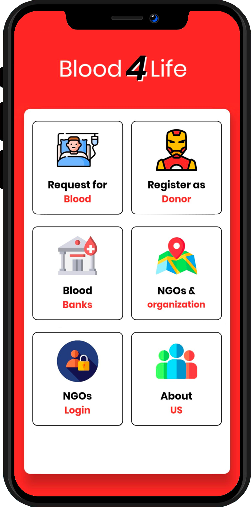
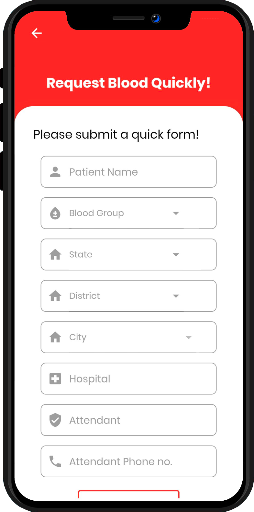
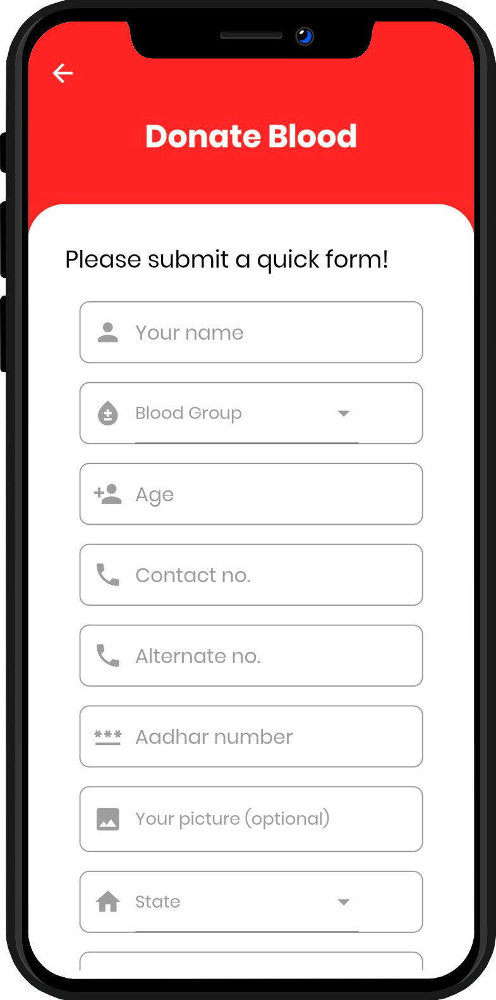
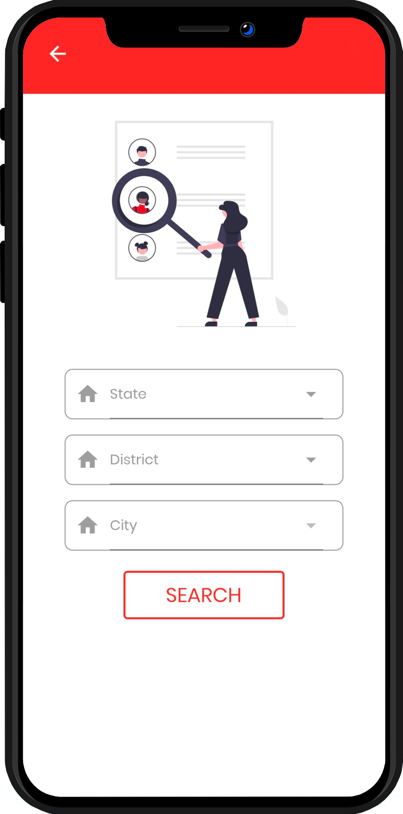
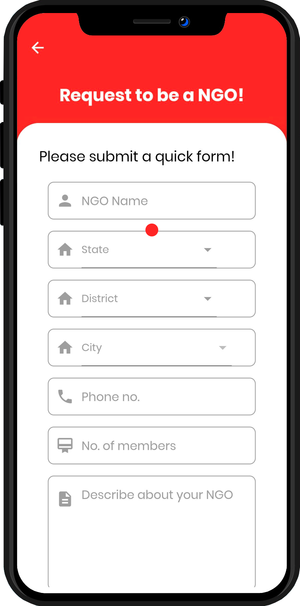
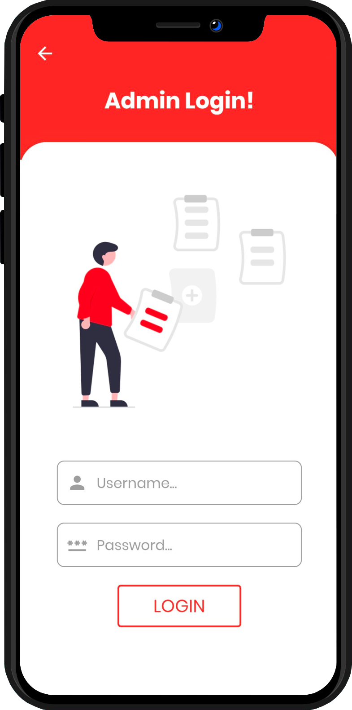
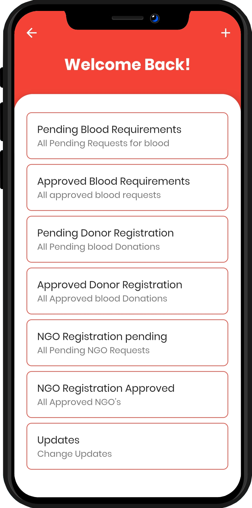
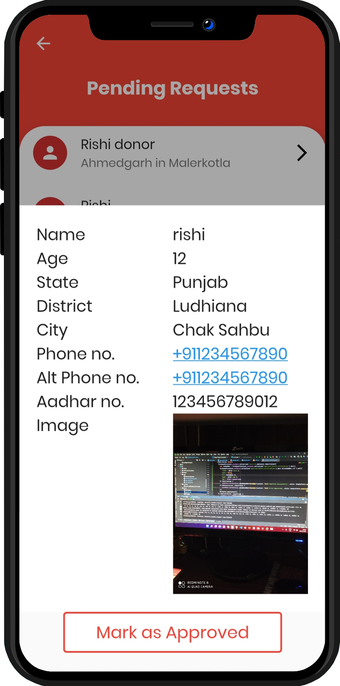
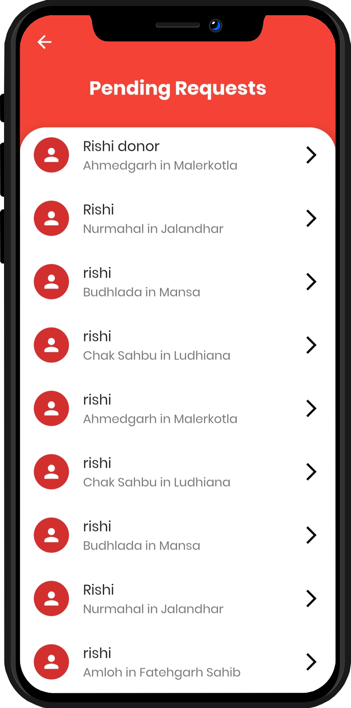

# <div align="center"></div>

# <div align="center">Blood 4 Life</div>

<div align="center">
  A sophisticated book management system with Neomorphic design
  <br />
  <a href="https://github.com/RishiAhuja/blood-donation"><strong>View Project »</strong></a>
  <br />
  <br />
  <a href="https://github.com/RishiAhuja/blood-donation/releases">Download</a>
  ·
  <a href="https://github.com/RishiAhuja/blood-donation/issues">Report Bug</a>
  ·
  <a href="https://github.com/RishiAhuja/blood-donation/issues">Request Feature</a>
</div>

<div align="center">
  


</div>

> ### ⚠️ Important Notice
> Cloud notifications are currently disabled due to server costs, though the feature is fully implemented in the codebase. For the latest stable version of the application, please visit our [releases page](https://github.com/RishiAhuja/blood-donation/releases).

## ✨ Features

- 🎨 **Elegant Neomorphic Design**
  - Sophisticated white theme
  - Modern and clean aesthetic
  - Intuitive user interface

- 📚 **Google Books Integration**
  - Vast repository of book information
  - Comprehensive book details
  - Manual book addition capability

- 📊 **Reading Analytics**
  - Reading speed tracking
  - Progress bookmarking
  - Detailed statistics
  - Interactive page slider

- 🎯 **Smart Features**
  - Dynamic color-based layouts
  - Cover-matched UI elements
  - Personalized reading experience

- 📝 **Wishlist Management**
  - Prioritized reading list
  - Custom book organization
  - Personal reading goals

- 🔍 **Advanced Search**
  - Quick book discovery
  - Efficient filtering
  - Comprehensive results

## 📱 Screenshots

<div align="center">
  
  
  
</div>

<div align="center">
  
  
  
</div>

<div align="center">
  
  
  
</div>

<div align="center">
  
</div>

## 🛠️ Technical Stack

- **Frontend Framework**: Flutter
- **Programming Language**: Dart
- **APIs & Services**: 
  - Google Books API
  - Firebase Cloud Messaging
  - Firebase Authentication
  - Cloud Firestore
- **Features**:
  - Version Control System
  - Real-time notifications
  - Dynamic UI generation
  - Reading analytics
  - Progress tracking

## 🚀 Getting Started

1. Download the latest release from our [releases page](https://github.com/RishiAhuja/blood-donation/releases)
2. Install the application
3. Sign up or log in
4. Start adding books to your library
5. Track your reading progress
6. Customize your reading experience

## 💻 Development Setup

```bash
# Clone the repository
git clone https://github.com/RishiAhuja/blood-donation.git

# Navigate to project directory
cd blood-donation

# Install dependencies
flutter pub get

# Run the app
flutter run
```

## 🤝 Contributing

Contributions are what make the open source community such an amazing place to learn, inspire, and create. Any contributions you make are **greatly appreciated**.

1. Fork the Project
2. Create your Feature Branch (`git checkout -b feature/AmazingFeature`)
3. Commit your Changes (`git commit -m 'Add some AmazingFeature'`)
4. Push to the Branch (`git push origin feature/AmazingFeature`)
5. Open a Pull Request

## 📫 Contact

Rishi Ahuja
- Portfolio: [Github Portfolio](https://rishiahuja.github.io/my-portfolio)
- Email: [www.rishiahuja@gmail.com](mailto:www.rishiahuja@gmail.com)

## 📱 Follow Me

[](https://x.com/Rishi2220)
[](https://www.linkedin.com/in/rishi-ahuja-b1a224310/)

## 💖 Support

[](https://www.buymeacoffee.com/RishiAhuja)
